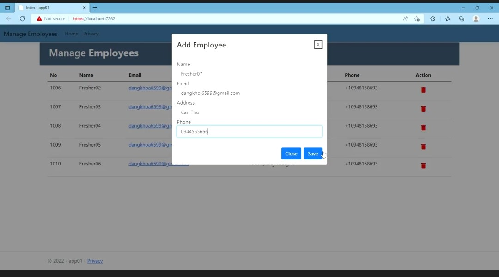
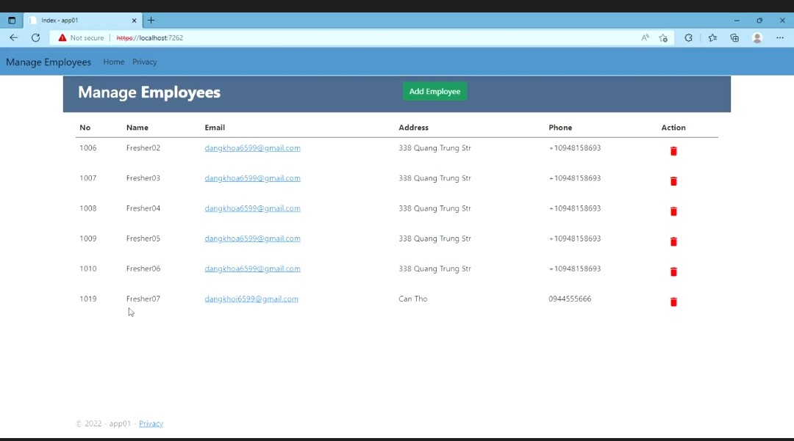
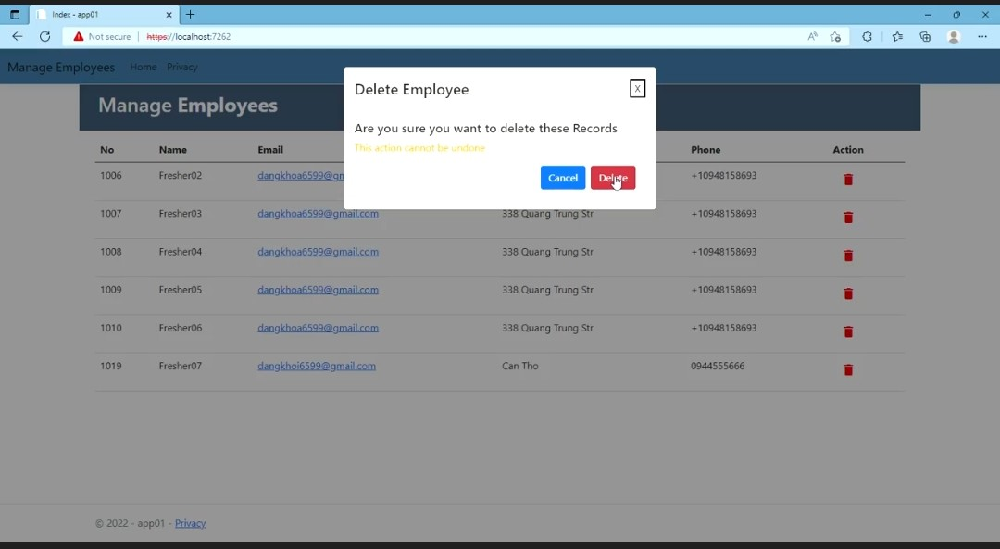

# Manage Employee using .NET MVC with Modal Pop-Up Bootstrap

- Goal: *Features: Add Employee, Delete Employee

## Screenshot
#### Add new employee
</img>
#### New employee is added
</img>
#### Press Delete Button to delete employee
</img>
## Steup
To run this project:
```
$ dotnet run
$ dotnet watch run
```
### Demo video
https://drive.google.com/file/d/1IiNEdIWIJB0abICOewLo15RC2bgTCxtg/view?usp=sharing

Happy Coding!!!
